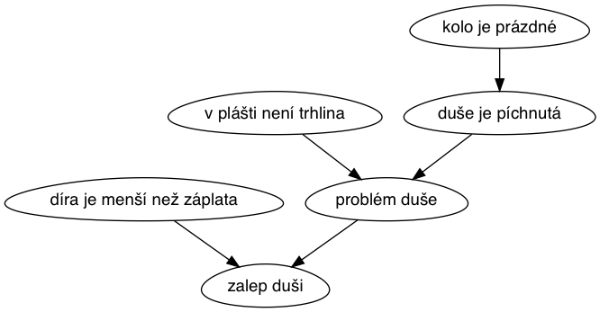

# 02 - Inferenční mechanismus

## Spuštění
Pro spuštění programu je potřeba zadat:

``` bash
python3 Inference.py
```

## Použití
Program se interaktivně ptá uživatele na otázky, které vedou k diagnostice kola uživatele. Možné odpovědi uživatele:

- y = yes, příznak je pravdivý
- n = no, příznak není pravdivý
- w = why, řekni mi, proč se ptáš právě na tuto otázku

Po nalezení řešení je taktéž možné odpovědět:
- y na otázku, zdali chce uživatel vysvětlit proč systém nalezl právě toto řešení

## Princip

0. data jsou načtena ze znalostní báze a parsována do formy AND stromu
0. u všech vrcholů je vypočítána maximální výška k libobolnému listu
0. program se ptá na vrcholy v grafu seřazené podle (primárně - maximální výška, sekundárně - nejvyšší počet odchozích hran) 
0. uživatel odpoví:
    0. **pravda** -> Program se soustředí pouze na podgraf, ve kterém užovatel odpověděl kladně. Z tohoto grafu se vymažou všichni následníci, kteří závisí pouze na tomto vrhcholu.
    0. **lež** -> Z grafu se vymaže vrchol a  všichni následníci. Navíc i předchůdci následníků, kteří mají pouze 1 výstupní hranu a tudíž by neměli žádné řešení.
0. konec programu
    0. **program našel řešení** -> Zeptá se uživatele, jestli chce zobrazit graf, díky kterému došel program k řešení.
    0. **program nenašel řešení** -> Inferenční mechanismus na základě zadané znalostní báze nedokázal najít řešení.
   
## Příklad nalezeného řešení:



#### Výstup programu:
``` text
Znalostní systém opraváře kol nastartován.
Je pravda, že "kolo vydává zvuk"? [y/n/w]: n
Je pravda, že "řetěz přeskakuje"? [y/n/w]: n
Je pravda, že "brzda nebrzdí"? [y/n/w]: n
Je pravda, že "kolo je prázdné"? [y/n/w]: y
Je pravda, že "v plášti není trhlina"? [y/n/w]: y
Je pravda, že "díra je menší než záplata"? [y/n/w]: y
Řešení: zalep duši
Chceš vysvětlit proč? [y/*]: y
Řešení bylo odvozeno od následujícího průchodu grafem: 
- kolo je prázdné -> duše je píchnutá
- v plášti není trhlina -> problém duše
- duše je píchnutá -> problém duše
- problém duše -> zalep duši
- díra je menší než záplata -> zalep duši
Konec programu.
```
